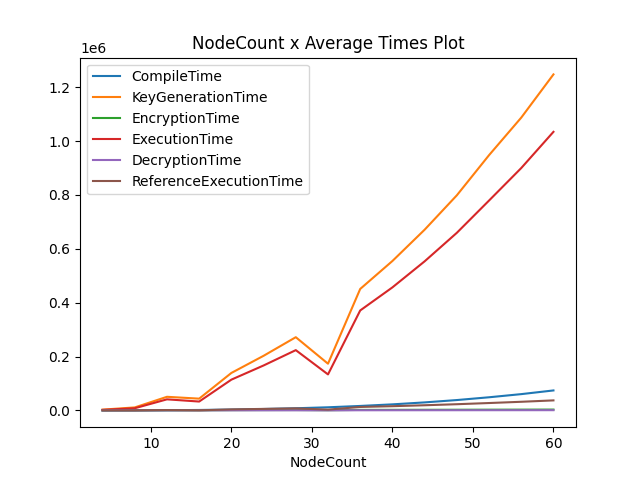
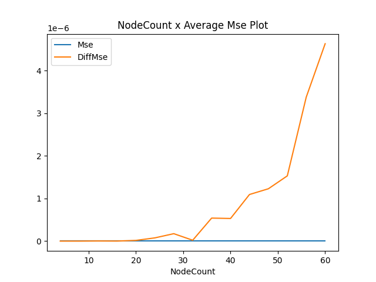
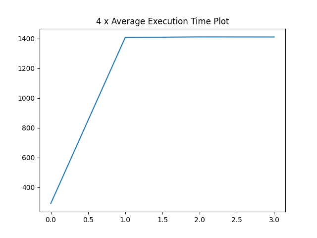
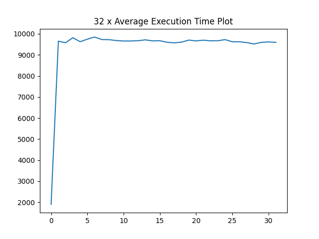

---
bibliography:
- references.bib
---

This report explains the secure computation of the total number of
spanning trees using homomorphic encryption. The algorithm implemented
is Kirchhoff's Matrix Tree Theorem for connected graphs, utilizing the
matrix multiplications of the laplacian matrix's lower and upper
triangular decomposition. The computation is iterative, where a server
and a client communicate back and forth. The server does the
calculations on encrypted data. The client performs only the division
operation on plain text. The code is implemented with python using the
Microsoft Eva compiler for the Microsoft Seal library. The
implementation is tested using connected Watts--Strogatz graphs of
varying node sizes (between 4 and 64). Extensive analysis of the
compilation, execution, key generation, encryption, decryption times,
and implementation correctness is shown. Moreover, the effectiveness of
using matrix multiplications instead of a loop-based method is discussed
for execution times and memory usage. To sum up, this report presents a
time and memory-efficient privacy-preserving implementation of
Kirchhoff's Matrix Tree Theorem for connected graphs.

# Introduction

Starting with a real-world example from [@MSTExamp], think of a
telecommunication company that wants to layout new fiber-optic cables to
some neighborhoods. Each neighborhood will have distinct cabling
processes. For each neighborhood, the company has a graph depicting the
routes for cable layout as edges and houses that will connect to the new
cables as nodes. The telecommunication company wants to finish the
layout process as fast as possible using the least resources. But the
neighborhoods can have different reasons to prevent or delay the
process. So, the company decided to analyze how many different ways
efficient cabling can be done and start with the neighborhood that has
the most different ways.

In this example, the company using the graphs of neighborhoods should
compute the total number of minimum spanning trees. However, the graphs
of the neighborhoods contain critical information that unwanted third
parties should not seize. Therefore, the graphs must be encrypted, and
any operation on those graphs should be done on the encrypted data. This
way, the company can share the information with trusted parties, and the
company can outsource computations without a worry. From this extended
example, one can understand the importance of graph analytic algorithms,
such as computing the total spanning trees and the algorithms'
encryption.

Luckily with the advancement of homomorphic encryption, we can do
computations on encrypted data and then decrypt to get the results as we
did the operations on the plain-text data. I implemented Kirchhoff's
matrix tree theorem using the Microsoft Seal library and Microsoft Eva
Compiler for Seal.

Implemention of this algorithm contains many components. Given the
graph's adjacency matrix, the first step is to compute the Laplacian of
the adjacency matrix. Then calculating any cofactor of the Laplacian
matrix will give the total number of spanning trees of the graph.
However, calculating the cofactor means computing the determinant.
Computing determinant takes in most of the algorithms O($n^3$) times.
But Gaussian elimination-based algorithms can be complex to implement
with homomorphic encryption frameworks like Seal. Therefore, I have
chosen a LU decomposition-based algorithm for computing the determinant.
This way, after the decomposition, the determinant is equal to the
multiplication of diagonal elements of the upper triangular matrix. The
only thing left is to choose a simple decomposition algorithm that can
be implemented with Seal. In that aspect, I have selected the Doolittle
Algorithm for LU decomposition, which is an iterative algorithm to
compute the decomposition.

The most crucial element of the Doolittle algorithm is that it can be
implemented as iterative matrix multiplications and updates of the
matrices. Due to interest in doing neural network-based operations in an
encrypted fashion using homomorphic encryption, there is a lot of
research on efficient homomorphic matrix operations.
[@10.1145/3243734.3243837; @https://doi.org/10.48550/arxiv.2201.12577; @Mishra2018FastSM]
And I have chosen the work by Jiang et al. [@10.1145/3243734.3243837]
for matrix multiplication operations as the test results and comparisons
with a loop-based Dolittle Algorithm show the effectiveness of the
implemented version.

# Background and Related Work

## Background

As mentioned in the Introduction, the main components of the algorithm
are: Computing the Laplacian Matrix Computing the cofactor of Laplacian
using LU Decomposition Homomorphic encryption of these steps using
Microsoft SEAL In this section, necessary background information about
these components is given.

As mentioned in the Introduction, the main components of the algorithm
are:

-   Computing the Laplacian Matrix

-   Computing the cofactor of Laplacian using LU Decomposition

-   Homomorphic encryption of these steps using Microsoft SEAL

In this section, necessary background information about these components
is given.

### Homomorphic Encryption

Most encryption algorithms are used to preserve data security while
storing or transferring the data. However, with the advancements in
cloud computing, many people use cloud resources to process the data,
which cannot be done securely with the classical encryption algorithms.
The encrypted data is decrypted before computation, then the calculation
is done on the plain-text data, and finally, the result is encrypted and
sent back. The decryption of the data in the cloud causes security
concerns. With homomorphic encryption, the computation is done on the
encrypted data. Therefore, there is no need to decrypt the data in the
cloud, so the data stays secure. In this implementation, due to working
with floating numbers, CKKS scheme is used. CKKS provides approximate
floating point arithmetic on cipher-text, with addition, multiplication
and rotation (shifting) of cipher-text.

### Laplacian Matrix

The Laplacian matrix is another representation of graphs similar to the
adjacency matrix. The Laplacian matrix is the discrete approximation of
the continuous Laplacian operator on graphs. It encodes beneficial graph
properties, which are used in many machine learning-based algorithms.
One can compute it from the adjacency matrix as: $$L = D - A,$$ where
$L$ is the Laplacian Matrix, the $A$ is the Adjacency Matrix and $D$ is
the Degree Matrix. Degree Matrix is a diagonal matrix, containing number
of neighbours for each node.

### LU Decomposition

LU Decomposition is the factorization of a matrix to a multiplication of
two matrices. One of the matrices is an upper triangular, and the other
is a lower triangular hence the name. It is used for efficiently solving
linear equations, matrix inversion, and computing the determinant. In
the determinant case, the computation of the determinant reduces to the
multiplication of diagonal elements of the upper triangular matrix.

## Related Work

In this section, two principal algorithms used for computing the total
number of spanning trees are introduced. The first algorithm is called
Doolittle Algorithm for LU Decomposition. As mentioned in the Background
section, factorization makes the determinant easier and keeps the
complexity of the computation to $O(n^3)$. The Doolittle Algorithm is an
iterative algorithm to compute decomposition:[@doolittle]:
$$\label{eqn:dl_it}
\begin{split}
    i &= 0 \xrightarrow[]{\forall j} U_{ij} = A_{ij}, \\ 
    i &> 0 \xrightarrow[]{\forall j} U_{ij} = A_{ij} - \sum_{k=0}^{i-1} L_{ik}U_{kj}, \\
    j &= 0 \xrightarrow[]{\forall i} L_{ij} = \frac{A_{ij}}{U_{jj}}, \\
    j &> 0 \xrightarrow[]{\forall i} L_{ij} = \frac{A_{ij}- \sum_{k=0}^{j-1} L_{ik}U_{kj}}{U_{jj}}. 
\end{split}$$ That is, starting with the first row of the upper
triangular and first column of the lower triangular matrix, at each
iteration the rows of upper triangular and columns of the lower
triangular matrices are computed. In these computations, the only
non-trivial computation with homomorphic encryption is the division.
There are works [@10.1007/978-3-319-70694-8_15] that introduce
approximation of inverse function. However, using a these approximations
with the other computations makes the overall architecture complex. The
second algorithm important for the implementation is efficient matrix
multiplications with homomorphic encryption [@10.1145/3243734.3243837].
Matrix multiplications are used for computing the upper and lower
triangular matrices. The reasons are discussed in the next section.

# Main Contributions

## Client-Server Architecture

Since the computation of inverse function with Homomorphic Encryption is
complex, a server-client architecture is implemented. Meaning that, in
an iterative fashion, the server does the computations on the encrypted
data, sends it to the client, client decrypts and does the division
operation and updates the lower triangular matrix. If the computations
are not finished, client encrypts the data and sends it back to server
for next computation. The number of iterations are both known by the
client and the server, but only client updates it.

At the start, the data send to the server as input is the graph's
adjacency matrix. The adjacency matrix is encoded as a plain-text such
that rows of the adjacency matrix is concatenated and a vector is
obtained. The plain-text is encrypted by the client and send to the
server. At the zeroth iteration, the laplacian matrix is computed and
the first row and first column of the upper and lower triangular
matrices are filled. The server returns the concatenation of the
laplacian, upper triangular and lower triangular matrices to the client.
Client decrypts the return, updates the iteration, and using the
iteration variable computes the inverse of the necessary upper
triangular matrix element and updates the lower triangular matrix with
it. After the computations by the client, client encrypts the
concatenated matrices and sends it to server. After the zeroth
iteration, the server computes the matrix multiplication of the lower
and upper triangular matrices using the methods introduced in
[@10.1145/3243734.3243837]. Then using the result of the multiplication,
the graph laplacian and masks computed using the iteration variable,
server updates the matrices. The number of iterations are the number of
nodes n. After the last iteration, the client computes the total number
of spanning trees using the upper triangular matrix.

## Computing Laplacian Matrix

To compute the Laplacian Matrix, first the Degree Matrix is computed.
Since the adjacency matrix is encoded as a vector, it is relatively easy
to compute the Degree Matrix. For an Adjacency Matrix with n nodes, each
row can be summed using n left shifts and adding the shifted vector to
original vector. After the summations, using plain-text mask vector and
right shifts a diagonal degree matrix can be obtained. Subtracting the
adjacency matrix from the diagonal degree matrix gives the Laplacian
matrix.

## Computing LU Decomposition with Matrix Multiplication

As shown in algorithm [\[eqn:dl_it\]](#eqn:dl_it){reference-type="ref"
reference="eqn:dl_it"}, the classical way of computing Doolittle
Algorithm is iterative updates. In the first implementation (tagged as
[milestone3](https://github.com/ozgraslan/CENG519-Project/tree/milestone3)
in the github repository), the iterative version is implemented.
However, due to memory issues discussed in
[4](#res_dis){reference-type="ref" reference="res_dis"}, a matrix
multiplication based version (tagged as
[milestone3.4](https://github.com/ozgraslan/CENG519-Project/tree/milestone3.4))
is implemented. Using a matrix multiplication based version comes from
the observation that at iteration i, the $i^{th}$ row and column of the
multiplication of the lower (the columns until the $i^{th}$ column is
filled and the other columns are zero) and the upper triangular (the
rows until the $i^{th}$ row is filled, the other rows are zero) matrices
gives the $i^{th}$ row for the upper triangular matrix, and the
subtraction term for the $i^{th}$ column of the lower triangular matrix
respectively.

# Results and Discussion {#res_dis}

## Methodology

All the experiments presented in the paper is done using python 3.8.10
and the main libraries used for implementation are:

-   Microsoft SEAL 3.6.4

-   Microsoft Eva 1.0.1

-   Numpy 1.22.3

-   Networkx 2.7.1

The hardware used in the experiments is Intel i9-9900K with 32 GB ram.
The experiments are run on 1 core only.

The graphs used in the experiments are connected Watts-Strogatz graphs.
The number of neighbours for each node is 3. And the connections are
reversed with probability 0.5.

For the experiments the node sizes between 4-60 are used. For each node
size, 50 experiments are done.

## Results

In this section the results of the matrix-based implementation is
presented. Since the algorithm is implemented as iterations between a
client and a server, sumation of all iterations are presented. Moreover,
the correctness of the algorithm is compared against a plaintext based
algorithm (for which networkx library is used), and since CKKS is an
aproximate scheme, the implemented algorithm is also run on plaintext
data and it is compared to the encrypyted version.

{width=".45\\textwidth"}
{width=".45\\textwidth"}

From these figures, it can be seen that with the increasing number of
nodes the execution times grows exponentially. There are two main
reasons for this growth. The first reason is that the number of
iterations is the number of nodes. So there are more iterations and the
total execution time increases. The second reason which I think is the
main reason, the size of the adjacency matrix increases with the node
size, therefore the matrix operations take more time. Below figure
explains this behaviour.

{width=".45\\textwidth"}
{width=".45\\textwidth"}

## Discussion

As mentioned before, the first implementation was iteration based, where
iteration number is used as the loop variable. And instead of matrix
multiplication, matrix mask operations, vector shifts and summations are
used. However, due to loop based implementation, at each iteration the
Eva Compiler unrolls the loops and create the plain-text masks before
they are used. This increases the memory usage after each iteration.
Also, this version uses a lot more plain-text mask at each iteration.
This version of the implementation resulted in above 32 GB memory usage
even for 24 node graphs. This issue is also discussed in [the SEAL
Github Repository](https://github.com/microsoft/SEAL/issues/365), but
there seamed no good solution for my implementation.

The matrix multiplication version, preserves the memory usage in each
iteration, since the matrix does not grow between each iteration.
Moreover, it simplifies the implementation with more modular code. With
this version, even 64 node graphs can be run with 32 GB memory.

# Conclusion

This report presents a secure matrix-based implementation of computing
the total number of spanning trees in a connected graph. The
implementation includes an iterative client-server architecture. In
which client only computes the reciprocal of specific values and use
those values to updates. The server side computes graph laplacian and
doolittle LU decoposition algorihtm using matrix multiplications. As
mentioned in the discussion, the matrix-based implementation provides
stable memory usage throughout the iterations.
